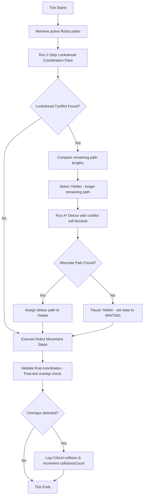

# AMR Simulator: Collision, Interference & Intersection (CI) Checks

This document explains the repository's internal Collision, Interference, & Intersection (CI) check system. These checks run in the simulation tick loop to coordinate robot movements, resolve path intersections, and log physical grid collisions.

---

## 1. System Overview

Rather than relying purely on ad-hoc state machines, the simulator uses a centralized **2-Step Lookahead Path Coordination** pass at the beginning of each simulation tick. This ensures robots negotiate priorities and dynamically recalculate paths before executing movements.

---

## 2. Collision Avoidance Algorithm

The coordination pass occurs iteratively (up to 5 passes to resolve multi-robot chain conflicts) within the `tick` action of `store/warehouseStore.ts`.

### 2.1 The Lookahead Window
For each moving robot, the algorithm scans up to two steps ahead:
*   **Step 1:** `robot.path[0]` (immediate next cell)
*   **Step 2:** `robot.path[1]` (cell after next)

### 2.2 Conflict Detection Categories
A conflict is flagged if a robot intersects with another moving robot's lookahead path in any of the following ways:
1.  **Step 1 Overlap (Same Cell Collision):** Both robots want to move to the exact same cell on the next tick (`next1 === next2`).
2.  **Step 2 Overlap (Future Collision):** Both robots plan to occupy the same cell in two ticks (`next1_2 === next2_2`).
3.  **Swap / Cross Collision:** Robot A is moving to Robot B's current cell, and Robot B is moving to Robot A's current cell on the same tick.

### 2.3 Priority Resolution Rules
When a conflict is detected, the system designates one robot as the **yielder** and the other as the **priority robot**:
*   **Metric:** Remaining path length (`path.length`).
*   **Rule:** The robot further from its destination (longest path) must yield to the closer one.
*   **Tie-Breaker:** If path lengths are equal, alphabetical order of IDs (`robot.id`) resolves the tie.

### 2.4 Detour & Yielding Implementation
The yielder attempts to find an alternative route:
1.  **Temporary Obstacle injection:** The conflict cell is injected into the A* pathfinder (`findPathAStar`) as a temporary 1x1 obstacle.
2.  **Rerouting:** The pathfinder attempts to find a route from the yielder's current position to its original target.
3.  **Fallback to Stop:** If no bypass route is available (e.g., in single-cell-wide aisles), the yielder clears its path, enters a `'WAITING'` state, and yields priority.

---

## 3. Physical Collision Detection

Even with lookahead coordination, physical overlaps can occur (e.g., if a user drags a robot directly onto an occupied cell during execution).
*   **Verification Pass:** A final check runs at the end of every tick comparing the finalized grid coordinates of all robots.
*   **Action:** If two robots occupy the same grid cell:
    1.  The global `collisionsCount` is incremented.
    2.  A critical alert is pushed to the communications log feed:
        `SYSTEM: COLLISION ALERT: Robots AMR-01 & AMR-02 overlapped at grid cell (X, Y)!`

---

## 4. Key Code Locations

*   **Lookahead Pass & Logic:** Check the `tick()` function in [`store/warehouseStore.ts`](file:///c:/Users/YOCKET-271/Documents/GitHub/sih26/store/warehouseStore.ts).
*   **Dynamic HUD Indicators:** View metrics display in [`components/simulation/SimulationControls.tsx`](file:///c:/Users/YOCKET-271/Documents/GitHub/sih26/components/simulation/SimulationControls.tsx).
*   **Repositioning / Snapping:** View dragging logic inside [`components/workspace/AmrRobot.tsx`](file:///c:/Users/YOCKET-271/Documents/GitHub/sih26/components/workspace/AmrRobot.tsx).
